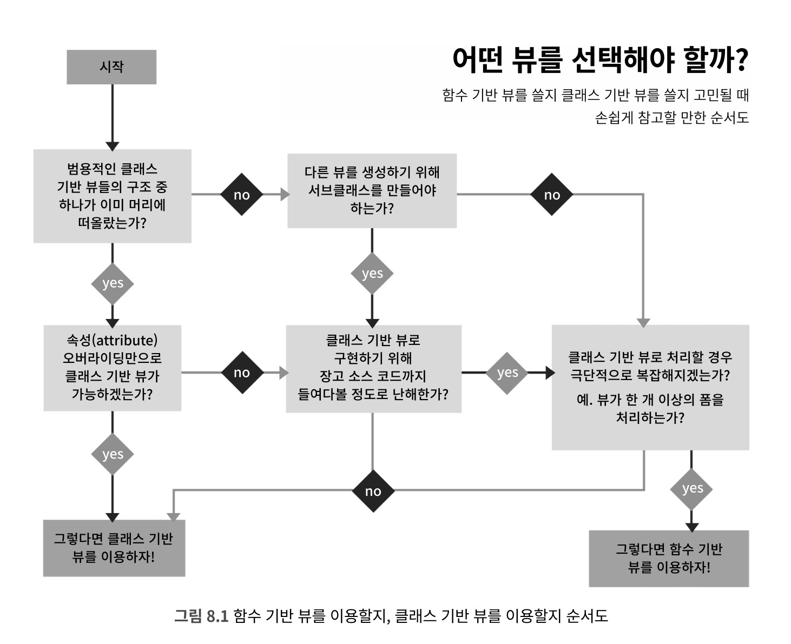

## Two scoops of django 8장 - 함수 기반 뷰와 클래스 기반 뷰

- 매번 뷰를 구현할 때마다 함수 기반 뷰로 하는 게 더 적당할지, 클래스 기반 뷰로 하는 게 더 적당할지 생각해보기

* URLConf로부터 뷰 로직을 분리하기

  * 뷰와 url의 결합은 최대한의 유연성을 제공하기 위해 느슨하게 구성되어야 하며 이는 많은 경험이 요구되는 일이다. 

  * 단순하고 명로하게 URL라우트를 구성하는 방법

    * 뷰 모듈은 뷰 로직을 포함해야 한다.
    * URL모듈은 URL로직을 포함해야 한다. 

  * 나쁜 예시

    ```PYTHON
    from django.conf.urls import url
    from django.views.generic import DetailView
    
    from testing.modles import Testing
    
    urlpatterns = [
       	url(r"^(?P<pk>\d+)/$"), DetailView.as_view(models=Testing, template_name"tastings/detail.html", name="detail"),
        url(r"^(?P<pk>\d+)/results/$"), DetailView.as_view(models=Testing, template_name"tastings/results.html", name="results"),
    ]
    ```
    * 뷰와 url, 모델 사이에 단단하게 종속적인 결합 => 뷰에서 정의된 내용이 재사용되기 어렵다
    * 클래스 기반 뷰들 사이에서 같거나 비슷한 인자들이 계속 이용되고 있는데(`models=Testing`, `template_name`..) 이는 **반복되는 작업을 하지 말라는** 철학에 위배되는 것
    * (url들의) 무한한 확장이 파괴되어 있음, 클래스 상속이 불가능

  * => view와 url분리하자

    ```python
    # tasting/views.py
    
    ...
    
    class TasteListView(ListView):
        model = Tasting
    
    class TasteResultView(DetailView):
        model = Tasting
    ```

    ```python
    # tasting/urls.py
    
    ...
    urlpatterns = [
        url(r"^(?P<pk>\d+)/$"), view=views.TasteDetailView.as_view(), name="detail"),
        url(r"^(?P<pk>\d+)/$"), view=views.TasteResultView.as_view(), name="results"),
    ]
    ```


    * 반복되는 작업하지 않기: 뷰들 사이에서 인자나 속성이 중복 사용되지 않음
    * 느슨한 결합
    * URLConf는 한 번에 한 가지씩 임무를 명확하고 매끄럽게 처리해야 함, URLConf는 URL라우팅이라는 한 가지 작업만 명확하게 처리하는 것이 목표
    * 클래스 기반이라는 것의 장점을 살림(상속)
    * 무한한 유연성(커스텀 로직)

* URL 이름공간 사용하기

  * 권장 패턴: `app_name:url_name` 
    * ex) `blog:detail`
  * URL이름은 짧고, 명확하게 작성(`tastings:detail`, `tastings:results`)

* URLConf에서 뷰를 문자열로 지목하지 말자

  ```PYTHON
  urlpatterns = patterns('',
  	url(r'^$', 'polls.views.index', name='index')
  )
  ```

  * 장고가 뷰의 함수, 클래스를 임의로 추가함 
    * 뷰에서 에러가 발생할 경우 디버그하기가 어려워짐

* 뷰에서 비즈니스 로직 분리하기

  * 모델 메서드, 매니저 메서드 또는 일반적인 유틸리티 헬퍼 함수들을 이용
  * 비즈니스 로직이 쉽게 재사용 가능한 컴포넌트가 되고 이를 뷰에서 호출하는 경우, 프로젝트에서 해당 컴포넌트를 확장하기 매우 쉬워짐
  * => 장고의 뷰에서 표준적으로 이용되는 구조 이외에 덧붙여진 비즈니스 로직을 발견할 때마다 해당 코드를 뷰 밖으로 이통시키기

* 뷰의 기본 형태들 => 기억해두자!

  ```python
  # 함수 기반 뷰의 기본 형태
  def simplest_view(request):
      # 비즈니스 로직
      return HttpResponse("FBV")
  
  # 클래스 기반 뷰의 기본 형태
  class SimplestView(View):
      def get(slef, request, *args, **kwargs):
          # 비즈니스 로직
          return HttpResponse("CBV")
  ```

  * 종종 우리에겐 한 기능만 따로 떼어 놓은 관점이 필요할 때가 있음
  * 장고의 함수 기반 뷰는 HTTP 메서드에 중립적이지만, 클래스 기반 뷰의 경우 메서드의 선언이 필요하다는 것을 설명해줌줌