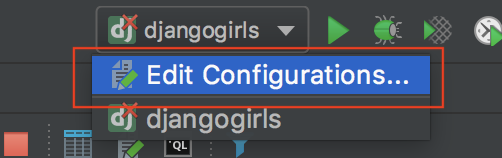
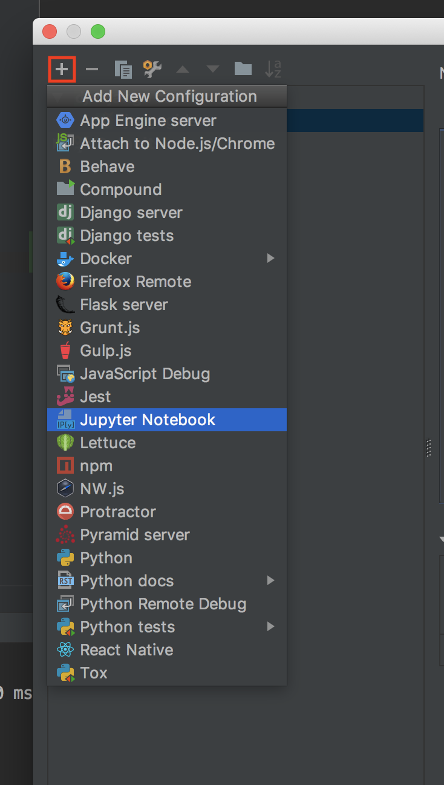
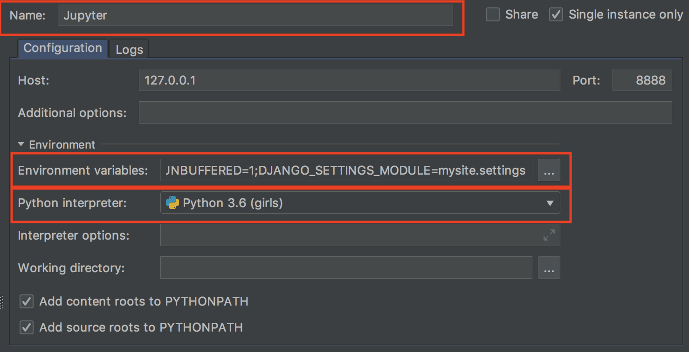
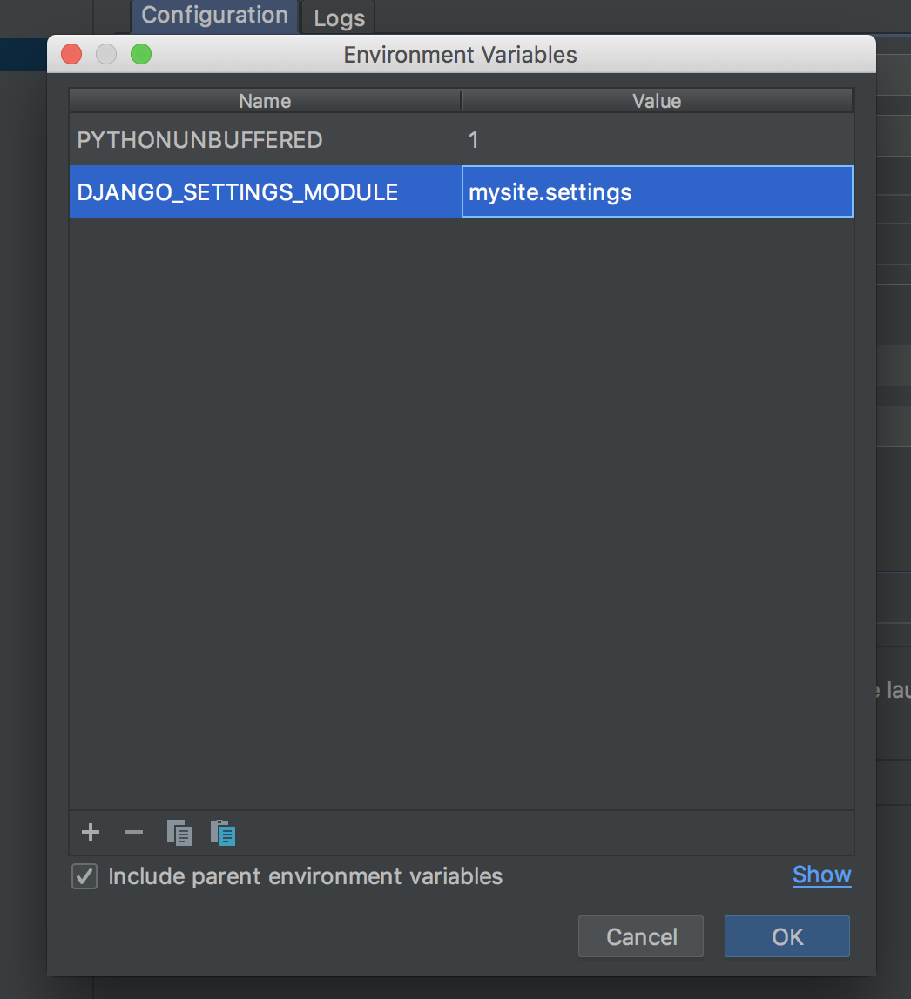
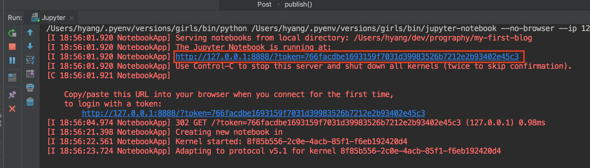

---

layout: post
title: "[프로그라피 수업준비]  Q. Django shell 쉽게 사용하는 법"
description: "프로그라피: 수업 준비"
date: 2018-10-19
tags: [prography]
comments: true
share: true목

---


> 10월 20일 프로그라피 Django session에서 공유한 내용입니다.

## Q3. shell 쉽게 사용하는 법

- 설치 

  - `django-extensions`  설치하기

    ```shell
    $ pip install django-extensions
    ```

  - `settings.py` 의 `INSTALLED_APPS`에 `django-extensions` 추가

    ```python
    INSTALLED_APPS = [
    		...    
        'django_extensions',
    ]
    ```

  - ipython, jupyter notebook 설치하기

    ```shell
    $ pip install "ipython[notebook]"
    ```

* Pycharm에서 실행 

  > 명령어치기 귀찮아.. ⇒ 파이참에 연결해서 버튼 클릭하나로 끝내봅시다!

  * 맨 우측 상단에 세모버튼 클릭후 Edit Configurations!

  
  * 새로운 창이 뜨는데 왼쪽 상단의 `+` 버튼을 클릭해서 jupyter노트북을 추가합니다.

  * Name 작성하고 환경변수를 설정합니다.

  * Python Interpreter는 프로젝트에서 사용하는 가상환경 선택해주세요.

    

  * 마지막으로 환경변수(Environment variables 부분)에 Django settings파일 경로를 설정해야합니다. 키는 `DJANGO_SETTINGS_MODULE` 값은 `프로젝트 네임.settings` 로 잡아 주시면 됩니다.

    

  * 실행 버튼을 클릭하면 jupyter 서버가 실행되는걸 확인할 수 있어요

    

    

  * localhost:8888로 브라우저에 접속해서 저 token값을 입력하거나 pycharm실행창에 있는 저 url을 클릭하셔도 됩니다.

* 이제 사용해봅시다! (Post CRUD 해보기!)

  ```python
  from blog.models import Post
  from django.contrib.auth.models import User
  ```

  ```python
  u = User.objects.get(username='manager')
  ```

  ```python
  for i in range(100):
      Post.objects.create(
      author=u,
      title="title{}".format(i),
      text="포스트 백개 작성!"
  )
  ```

  ```python
  posts = u.post_set
      posts = Post.objects.filter(author=u)
  ```

  ```
  p = Post.objects.get(author=u, title="title98")
  ```

  ```python
  p.title = "updated_title"
  p.save()
  print(p.title)
  ```

  ```python
  p.delete()
  ```


