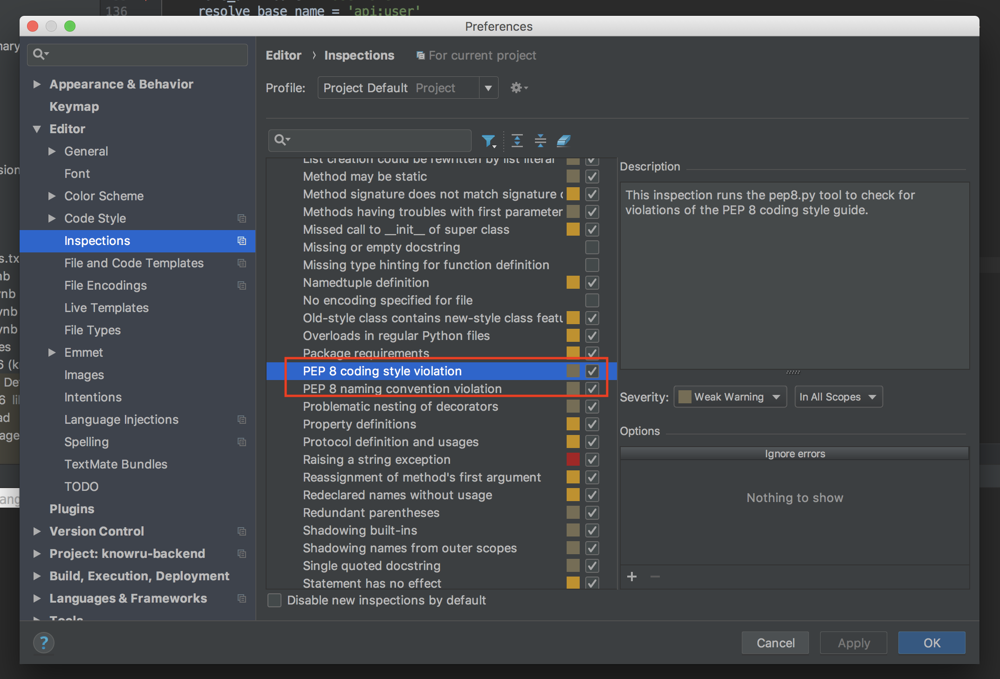

---

layout: post
title: "[프로그라피 수업준비]  Q. 파이썬 코딩 컨벤션"
description: "프로그라피: 수업 준비"
date: 2018-10-19
tags: [prography]
comments: true
share: true목

---


> 10월 20일 프로그라피 Django session에서 공유한 내용입니다.

## Q3. 파이썬 코딩 컨벤션 준수하기

- `pep8` 을 준수합시다.

  - 파이썬을 사용할 때 함께 지키기로 약속한 규칙
  - 협업할 때의 예의, 코드가 가독성이 좋아지고 깔끔해진다! 협업할 때 꼭 지켜줍시다!
  - pycharm에는 기본적으로 설정되어 있어요

  

  - 자동 수정 단축키

    - import 문 정리: `ctrl + alt + o`
    - 자동 코드 정렬: 
      - 윈도우, 우분투: `ctrl +alt + i`
      - 맥: `com + alt + i`
    - 단축키 설정에서 변경할 수 있습니다.

  - 검사 패키지 설치

    ```bah
    $ pip install flake8
    ```

  - 검사 실행

    ```bash
    $ flake8 <path>
    ```


  참고 자료

------

  <https://spoqa.github.io/2012/08/03/about-python-coding-convention.html>